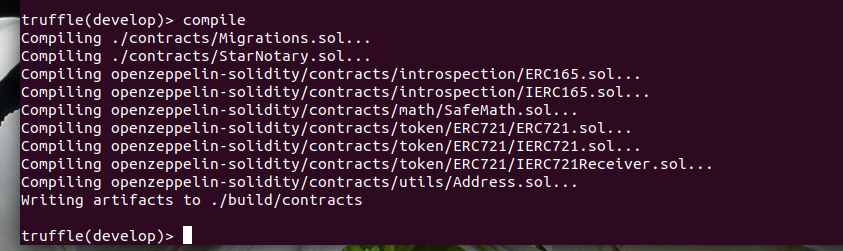
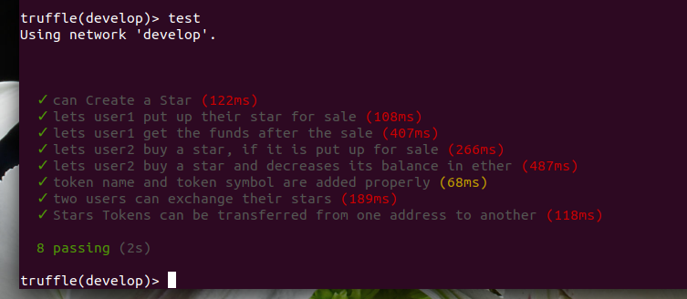
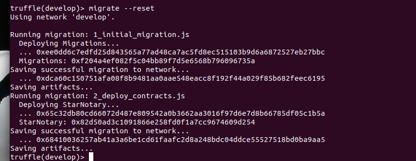
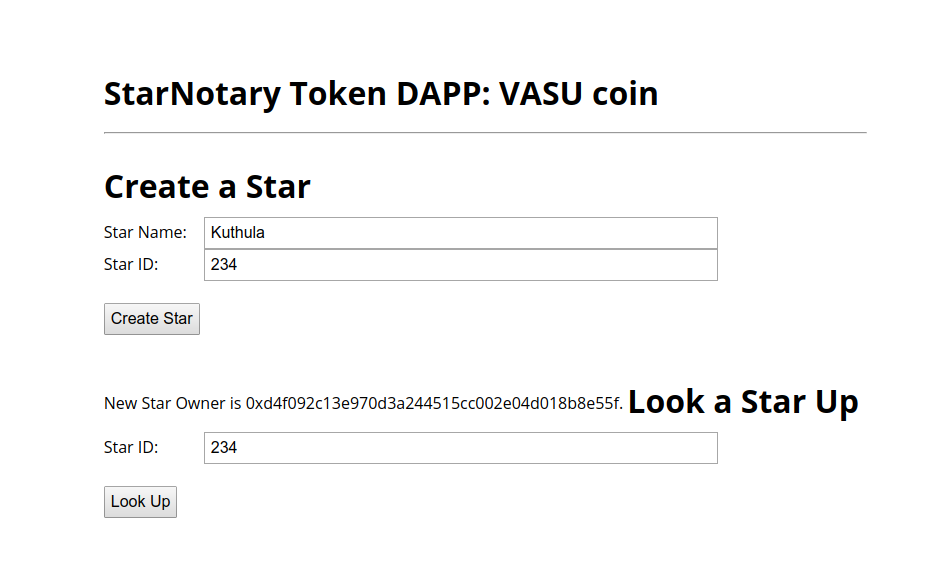
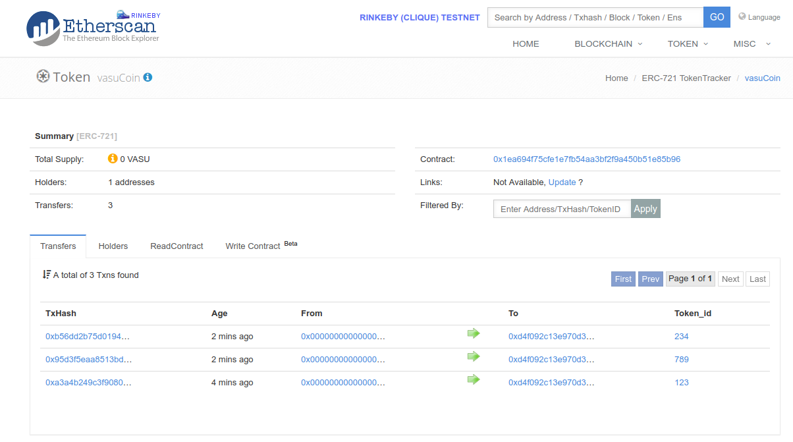

# Decentralized Star Notary Service 

### Token Name : vasuCoin

### Symbol: VASU

### Visit Ether scan to view VASU coin

https://rinkeby.etherscan.io/token/0x1ea694f75cfe1e7fb54aa3bf2f9a450b51e85b96

-----------------------

### How to Proceed

1. Install proper ```truffle``` with version matching to your pragma (solidity)
```
$ sudo npm install -g truffle@4.1.15
```
2. Install required npm packages

```
$ npm install
```
3. Develop

```
$ truffle develop
```


4. Compile

```
> compile
```


5. Test

```
> test
```


6. Migrate

```
> migrate --reset 
```




6. Open New terminal and type:

```
$ npm run dev
```



***Note:*** If you are deploying your code from aws EC2, remember to port locolhost:8080 from cloud to your local pc by doing:

```
$ ssh -N -L 8080:127.0.0.1:8080 -i key.pem ununtu@X.X.X.X

```

Then browse from localhost:8080

7. Follow Etherscan to view transection



### Udacity Honor Codes:
1. Some code implementations are learned from: https://github.com/KushalGH/boilerPlateDAPPproject ans https://github.com/g7845123/boilerPlateDAPPproject
2. Some coding ideas are taken from : https://knowledge.udacity.com/questions/21638
3. Thanks for reply at: https://knowledge.udacity.com/questions/24967
4. Thanks for reply at : https://knowledge.udacity.com/questions/20798
